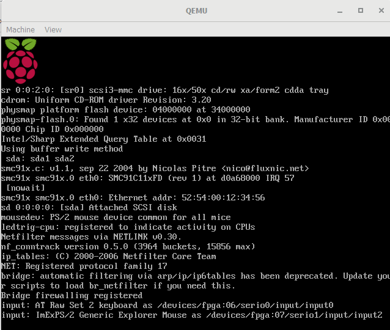

#### 1. Instalar QEMU en Windows 10 de 64 bits
Vaya al siguiente sitio web https://www.qemu.org/download/ y descargue el último instalador de QEMU para Windows de 64 bits.

#### 2. Descargar un Kernel de Linux
Vaya al siguiente sitio web https://github.com/dhruvvyas90/qemu-rpi-kernel y descargue un kernel adecuado, p. Ej. kernel-qemu-4.4.34-jessie
#### 3. Descargar imagen del sistema operativo Raspbian
- Vaya al siguiente sitio web http://downloads.raspberrypi.org/raspbian/images/ y descargue la última imagen, p.Ej.2019-06-20-raspbian-buster.zip
- Descomprima el archivo de imagen en una carpeta, p.Ej./Temp/raspbian/2019-06-20-raspbian-buster.img
#### 4. Crear un archivo bat de Windows
Ejecute un editor de texto.
Escriba las siguientes líneas.
```
"c:\Program Files\qemu\qemu-system-arm.exe" ^
-kernel kernel-qemu-4.4.34-jessie ^
-cpu arm1176 ^
-m 256 ^
-M versatilepb ^
-serial stdio ^
-append "root=/dev/sda2 rootfstype=ext4 rw" ^
-hda 2019-06-20-raspbian-buster.img ^
-net nic ^
-net user,hostfwd=tcp::5022-:22 ^
-no-reboot
```
- Guardar como un archivo bat
**NOTA:** Para ello creamos una carpeta llamada rpi y en ella guadamos el archivo .bat junto con la imagen
#### 5. Ejecutar QEMU
Abre un símbolo del sistema.
Cambie el directorio a la carpeta que contiene el núcleo y los archivos de imagen, cambie la ruta segun sea pertinente Escriba el comando:
`C:\> nombre_archivo.bat`
Después de ejecutarlo aparecerá la ventana de QEMU ejecutando Raspbian OS




Para correr nuestros programas CPP y helloWorld.s tenemos que escribir en la terminal los siguientes comandos:
`sudo apt-get update`
`sudo apt-get install build-essential` 

El paquete build essential lleva la mayoría de las herramientas, entre estas el gcc

Después clonaremos el repositorio con nuestros programas
`git clone https://github.com/silviasalazar/Lenguajes-de-interfaz.git`

Para ejecutar los programas escribimos lo siguiente:
`g++ o- nombre nombre.cpp`

### Resultados:

**Programa helloWorld!**
``` c++
@ hello.s
@ Instituto Tecnologico de Tijuana 
@ Materia: Lenguajes de Interfaz
@ Alumna: Salazar Felix Silvia Alejandra
@ Un programa muy sencillo en ensamblador que muestra "Hello World!"
@	


@ ---------------------------------------
@	Data Section
@ ---------------------------------------
	
	.data
string: .asciz "\nHello World!\n"
	
@ ---------------------------------------
@	Code Section
@ ---------------------------------------
	
	.text
	.global main
	.extern printf

main:
        push {ip, lr}

        ldr r0, =string
        bl printf

        pop {ip, pc}
```


**Programa 1: Dibujar un cuadro**
```c++
@ DibujarCuadro.cpp
@ Instituto Tecnologico de Tijuana 
@ Materia: Lenguajes de Interfaz
@ Alumna: Salazar Felix Silvia Alejandra
@ Un programa muy sencillo que dibuja un cuadro utilizando c++
@

#include <iostream>
#include <conio.h>

using namespace std;


int main()
{
    int lado;
    cout << "Introducir largo del lado: ";
    cin >> lado;
    for (int i = 0; i < lado; i++)//fila
    {
        for (int j = 0; j < lado;j++)//columna
        {
            if (i == 0 || j == 0 || i == lado - 1 || j == lado - 1) {
                cout << "*";
            }
            else
            {
                cout << " ";
            }
        }
       cout << endl;
        
    }
}

```
**Programa 2: Adivinar el número**
```c++
@ AdivinaNumero.cpp
@ Instituto Tecnologico de Tijuana 
@ Materia: Lenguajes de Interfaz
@ Alumna: Salazar Felix Silvia Alejandra
@ Un programa en el cual la computadora intentará adivinar el número que tu estas pensando, le indicarás si el número que te proporciona es mayor, menor o igual.
@

#include <iostream>
#include <ctime>
#include <cstdlib>
#include <stdlib.h>
#include <time.h>

using namespace std;
int main()
{
    //Declaración de variables
    int LimInferior, LimSuperior, num;
    char entrada;
    srand(time(NULL));
    //Insercion de limites
    cout << "Introduce limite inferior: " << endl;
    cin >> LimInferior;
    cout << "Introduce limite superior: " << endl;
    cin >> LimSuperior;

    num = (LimInferior) + rand() % (LimSuperior -LimInferior);//genera numero aleatorio
   
    cout << "Piensa en un numero..."<<endl << endl;
    
    int cont = 0;
    do 
    {
        
        cont++;
        
        cout << "El numero es: " << num << " ?" << endl;
        cout << "s=Menor, b=Mayor, c=Correcto" << endl;
        cin >> entrada;
        switch (entrada)
        {
        case 's':
            LimSuperior = num;
            num = (LimInferior)+rand() % (LimSuperior - LimInferior);
            break;
        case 'b':
            LimInferior = num;
            num = (LimInferior)+rand() % (LimSuperior - LimInferior);
            break;
        case 'c':
            cout << " " << endl << endl;
            cout << "F  E  L  I  C  I  D  A  D  E  S " << endl;
            cout << "Intentos: "<<cont;
            break;
        default:
            cout << "Por favor introduce un valor existente"<<endl;
            break; 
        }


    } while (entrada != 'c');
    
}

```


**Programa 3: Adivina un número aleatorio generado por la computadora**
```c++
@ AdivinarNumeroCercano.cpp
@ Instituto Tecnologico de Tijuana 
@ Materia: Lenguajes de Interfaz
@ Alumna: Salazar Felix Silvia Alejandra
@ Correr un programa que pida a dos jugadores que adivinen un numero que la computadora saque al azar  entre 1 y 75
@ El programa dara 15 puntos al jugador que dela respuesta mas proxima 

#include <iostream>
#include <stdlib.h>
#include <time.h>
#include <ctime>
#include <cstdlib>
#include <stdlib.h>
using namespace std;
int main()
{
    int num;
    int p1;
    int p2;
    int diferencia1, diferencia2;
    int cercano;
    srand(time(NULL));
    num = 1 + rand() % 75-1;
    

    cout << "Player1: ";
    cin >> p1;
    cout << "Player2: ";
    cin >> p2;


    if (num == p1)
    {
        cout << "Ganador: Player1 +15 puntos" << endl;
    }
    else if (num == p2)
    {
        cout << "Ganador: Player2 +15 puntos" << endl;
    }
    else
    {
        diferencia1 =abs(num - p1);
        diferencia2 = abs(num - p2);
        if (diferencia1 > diferencia2)
        {
            cout << "Ganador: Player2 +15 puntos" << endl;
        }
        else
        {
            cout << "Ganador: Player1 +15 puntos" << endl;
        }
    }

    cout << "El numero random es: " << num << endl;
}
```


**Programa 4: Calcular directriz y foco**
```c++
@ DirectrizyFoco
@ Instituto Tecnologico de Tijuana 
@ Materia: Lenguajes de Interfaz
@ Alumna: Salazar Felix Silvia Alejandra
@ Introducir A,B,C para la parabola y=Ax2+Bx+C, donde A!=0. Calcular la ecuación de la directriz y las coordenadas del foco
@ Capitulo 2

#include <iostream>

using namespace std;

int main()
{
    double a, b, c, x, y, directriz, foco, distancia;
    cout << "Valor de A: ";
    cin >> a;
    cout << "Valor de B: ";
    cin >> b;
    cout << "Valor de C: ";
    cin >> c;

    if (a != 0)//si A es diferente a 0 entonces:
    {
        //Calcular vertice
        if (a > 0) //si A es mayor que 0 entonces: 
        {
            x = a; //valor de x
        }
        else if (a < 0) //si A es menor que 0, entonces:
        {
            x = a * -1;
        }
        y = c; //valor de y
        cout << "Vertice: " << " (" << x << "," << y << ")" << endl << endl;

        //Calcular distancia
        distancia = abs(b - c);

        //Calcular directriz
        directriz = c + (distancia / 2);
        cout << "Directriz: " << directriz << endl << endl;

        //Calcular foco
        cout << "Foco: " << " (" << x << "," << y - (distancia / 2) << ")" << endl;
    }
    else //sino:
    {
        cout << "Por favor introduce un valor diferente a 0 para A";
    }
}


```


**Programa 5: Calcular la pendiente**
```c++
@ Pendiente.cpp
@ Instituto Tecnologico de Tijuana 
@ Materia: Lenguajes de Interfaz
@ Alumna: Salazar Felix Silvia Alejandra
@ Introducir dos parejas de coordenadas, encontrar la pendiente de la linea recta que contiene los puntos
@ e imprimir los resultados como números racionales en sus minimas expresiones. Si el resultado es negativo hacer que 
@ el numerador sea el número negativo
@ Capitulo 2

#include <iostream>

using namespace std;

int main()
{
    float x1, y1, x2, y2,m;
    cout << "Inserta X1: ";
    cin >> x1;
    cout << "Inserta Y1: ";
    cin >> y1;
    cout << "Inserta X2: ";
    cin >> x2;
    cout << "Inserta Y2: ";
    cin >> y2;
    cout << endl << endl;
    cout << "Calculando pendiente de: " << endl;
    cout << "(" << x1 << "," << y1 << ")" << " y " << "(" << x2 << "," << y2 << ")"<<endl<<endl;
    m = (y2 - y1) / (x2 - x1);
    cout << "La pendiente es: " << (y2 - y1)<<" / " << (x2 - x1)<<" = "<<m << endl;

}

```


