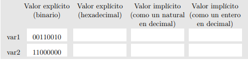
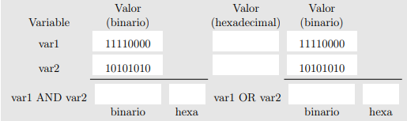
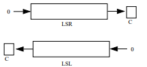
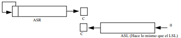
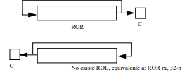

# 1.1. Lectura Previa
## 1.1.1. Características generales de la arquitectura ARM
ARM es una arquitectura RISC (Reduced Instruction Set Computer=Ordenador
con Conjunto Reducido de Instrucciones) de 32 bits, salvo la versión del core ARMv8-
A que es mixta 32/64 bits (bus de 32 bits con registros de 64 bits). Se trata de una
arquitectura licenciable, quiere decir que la empresa desarrolladora ARM Holdings
diseña la arquitectura, pero son otras compañías las que fabrican y venden los chips,
llevándose ARM Holdings un pequeño porcentaje por la licencia.
### Registros
La arquitectura ARMv6 presenta un conjunto de 17 registros (16 principales más
uno de estado) de 32 bits cada uno.

Registros generales:
| R0  	|
|-----	|
| R1  	|
| R2  	|
| R3  	| 
| R4  	|
| R5  	|
| R6  	|
| R7  	|
| R8  	|
| R9  	|
| R10 	|
| R11 	|
| R12 	|

Registros especiales:
| SP (R13) 	| Stack Pointer ó Puntero de Pila. Sirve como puntero para almacenar variables locales y registros en llamadas a funciones.               |
|-----------|-----------------------------------------------------------------------------------------------------------------------------------------|
| LR (R14) 	|Link Register ó Registro de Enlace. Almacena la dirección de retorno cuando una instrucción BL ó BLX ejecuta una llamada a una rutina.   |
| PC (R15) 	|Program Counter ó Contador de Programa. Es un registro que indica la posición donde está el procesador en su secuencia de instrucciones. |


Registro CPSR:

Almacena las banderas condicionales y los bits de control. Los
bits de control definen la habilitación de interrupciones normales (I), interrupciones rápidas (F), modo Thumb
(T) y el modo de operación de la CPU.
| N 	| Z 	| C 	| V 	| sin usar 	| I 	| F 	| T 	| modo 	|
|---	|---	|---	|---	|----------	|---	|---	|---	|------	|

## 1.1.2. El lenguaje ensamblador
El ensamblador es un lenguaje de bajo nivel que permite un control directo de la CPU y todos los elementos asociados. Cada línea de un programa ensamblador consta de una instrucción del procesador y la posición que ocupan los datos de esa instrucción.
Generalmente, y dado que crear programas un poco extensos es laborioso, el
ensamblador se utiliza como apoyo a otros lenguajes de alto nivel para 3 tipos de situaciones:
- Operaciones que se repitan un número elevado de veces.
- Cuando se requiera una gran velocidad de proceso.
- Para utilización y aprovechamiento de dispositivos y recursos del sistema.

## 1.1.3. El entorno
Los pasos habituales para hacer un programa (en cualquier lenguaje) son los siguientes:
- El programa se escribe en el lenguaje fuente mediante un editor de programas. 
- El resultado es un fichero en un lenguaje que puede entender el usuario, pero no la máquina. 
- Para traducirlo a lenguaje máquina hay que utilizar un programa traductor. 
- Un fichero ejecutable contiene el programa traducido más una serie de códigos que debe tener todo programa que vaya a ser ejecutado en una máquina determinada. 
- El encargado de unir el código del programa con el código de estas librerías es un programa llamado montador (linker) que genera el programa ejecutable
Utilizaremos el editor nano para crear y editar los módulos fuente de nuestros programas. 

## 1.1.4. Configuración del entorno para realizar prácticas en casa
En nuestro caso seria lo que hicimos en clase, resumidamente los pasos son los siguientes:
- 1. Descargamos el emulador QEMU
- 2. Descargamos el kernel de linux
- 3. Creamos una carpeta nueva en ella pondremos nuestras descargas
- 4. Abrimos el simbolo del sistema (CMD)
- 5. Lo ejecutamos

## 1.1.5. Aspecto de un programa en ensamblador
*La estructura más general de un módulo fuente es:*
- **Sección de datos.** Viene identificada por la directiva .data. En esta zona se definen todas las variables que utiliza el programa con el objeto de reservar memoria para contener los valores asignados.
- **Sección de código.** Se indica con la directiva .text, y sólo puede contener código o datos no modificables.

## Ensamblar y linkar un programa
La traducción o ensamblado de un módulo fuente se realiza con el programa Gnu Assembler, con el siguiente comando:

`as -o nombreprograma.o nombreprograma.s`

El as genera un fichero **nombreprograma.o.**

Para montar (linkar) hay que hacer: `gcc -o nombreprograma nombreprograma.o`

Una vez hecho ésto, ya tenemos un fichero ejecutable (nombreprograma) que podemos ejecutar o depurar con el gdb.

## 1.2. Enunciados de la práctica
Una vez hecho ésto, ya tenemos un fichero ejecutable (nombreprograma) que podemos ejecutar o depurar con el gdb.

Como se muestra a continuación:


### 1.2.1. Cómo empezar?


### 1.2.2. Enteros y naturales
#### Ejercicio 1.1 y 1.2
Suponemos dos variables de longitud un byte var1 y var2 con los valores binarios (00110010b) y (11000000b), respectivamente. Completa las casillas en blanco.



Calcula ahora la suma de los dos números y responde en las casillas en blanco.
```assembly
.data
var1 : .byte 0b00110010
.align
var2 : .byte 0b11000000
.align

.text
.global main
main : ldr r1, = var1 /* r1 <- & var1 */
ldrsb r1, [ r1 ] /* r1 <- *r1 */
ldr r2, = var2 /* r2 <- & var2 */
ldrsb r2, [ r2 ] /* r2 <- *r2 */
add r0, r1, r2 /* r0 <- r1 + r2 */
bx lr
```

Después de guardar el código escribimos lo siguiente:
`as -o intro1.o intro1.s`

Seguido del mismo escribimos:
`gcc -o intro1 intro1.o`

Por ultimo:
`gdb intro1`

### 2.2.3. Instrucciones lógicas
#### Ejercicio 1.5
Supón que tienes dos variables de tamaño 1 byte, var1 y var2, con los valores 11110000b y 10101010b. Calcula el resultado de hacer una operación AND y una operación OR entre las dos variables.



```assembly
.text
.global main
main : mov r2, # 0b11110000 /* r2 <- 11110000 */

mov r3, # 0b10101010 /* r3 <- 10101010 */
and r0, r2, r3 /* r0 <- r2 AND r3 */
orr r1, r2, r3 /* r1 <- r2 OR r3 */
mvn r4, r0 /* r4 <- NOT r0 */
mov r0, # 0x80000000
tst r0, # 0x80000000
tst r0, # 0x40000000
bx lr

```
Según el libro este tiene el nombre de intro3.s, entonces:
`as -o intro1.o intro3.s`

Seguido del mismo escribimos:
`gcc -o intro3 intro3.o`

Por ultimo:
`gdb intro3`

### 1.2.4. Rotaciones y desplazamientos
Las instrucciones de desplazamiento pueden ser lógicas o aritméticas.

- **Lógicas:** Desplazan los bit del registro fuente introduciendo ceros (uno o más de uno). El último bit que sale del registro fuente se almacena en el flag C.



- **Aritméticas:** El desplazamiento aritmético hace lo mismo, pero manteniendo el signo 



Las **instrucciones de rotación** también desplazan, pero el bit que sale del valor se realimenta.



#### Ejercicio 1.8 (intro4.s)
```Assembly
.data
var1 : .word 0x80000000
.text
.global main

main : ldr r0, = var1 /* r0 <- & var1 */
ldr r1, [ r0 ] /* r1 <- *r0 */
LSRs r1, r1, #1 /* r1 <- r1 LSR #1 */
LSRs r1, r1, #3 /* r1 <- r1 LSR #3 */
ldr r2, [ r0 ] /* r2 <- *r0 */
ASRs r2, r2, #1 /* r2 <- r2 ASR #1 */
ASRs r2, r2, #3 /* r2 <- r2 ASR #3 */
ldr r3, [ r0 ] /* r3 <- *r0 */
RORs r3, r3, # 31 /* r3 <- r3 ROL #1 */
RORs r3, r3, # 31 /* r3 <- r3 ROL #1 */
RORs r3, r3, # 24 /* r3 <- r3 ROL #8 */
ldr r4, [ r0 ] /* r4 <- *r0 */
msr cpsr_f, #0 /* C=0 */
adcs r4, r4, r4 /* rotar izda carry */
adcs r4, r4, r4 /* rotar izda carry */
adcs r4, r4, r4 /* rotar izda carry */
msr cpsr_f, # 0x20000000 /* C=1 */
adcs r4, r4, r4 /* rotar izda carry */
bx lr
```

### 1.2.5. Instrucciones de multiplicación
Las instrucciones de multiplicación admiten muchas posibilidades, debido a que es una operación en la cual el resultado tiene el doble de bits que cada operando.
En la siguiente tabla vemos las 5 instrucciones de multiplicación que existen:

| Instrucción| Bits| Nombre|
|-------------|----|-------|
|mul| 32=32x32| Multiplicación truncada|
|umull| 64=32x32| Multiplicación sin signo de 32bits|
|smull| 64=32x32| Multiplicación con signo de 32bits|
|smulw*| 32=32x16| Multiplicación con signo de 32x16bits|
|smul**| 32=16x16| Multiplicación con signo de 16x16bits|


# 2.1. Lectura previa
## 2.1.1. Modos de direccionamiento del ARM
En la arquitectura ARM los accesos a memoria se hacen mediante instrucciones específicas *ldr y str*
o la arquitectura nos fuerza a que trabajemos de un modo determinado: primero cargamos los registros desde memoria, luego procesamos el valor de estos registros con el amplio abanico de instrucciones del ARM, para finalmente volcar los resultados desde registros a memoria. 

- **Direccionamiento inmediato.** El operando fuente es una constante, formando parte de la instrucción.
```Assembly
mov r0, # 1
add r2, r3, #4
```
- **Direccionamiento inmediato con desplazamiento o rotación.** Es una variante del anterior en la cual se permiten operaciones intermedias sobre los registros.
```Assembly
mov r1, r2, LSL #1 /* r1 <- (r2*2) */
mov r1, r2, LSL #2 /* r1 <- (r2*4) */
mov r1, r3, ASR #3 /* r1 <- (r3/8) */
```

- **Direccionamiento a memoria, sin actualizar registro puntero.** Es la forma más sencilla y admite 4 variantes. Después del acceso a memoria ningún registro implicado en el cálculo de la dirección se modifica.
```Assembly
mov r2, # 1 /* r2 <- 1 */
str r2, [ r1, #+ 12 ] /* *( r1 + 12) <- r2 */
```
- **Direccionamiento a memoria, actualizando registro puntero.** En este modo de direccionamiento, el registro que genera la dirección se actualiza con la propia dirección. 
```Assembly
mov r2, # 0 /* r2 <- 0 */
str r2, [ r1 ] , #+ 4 /* a[0] <- r2 */
str r2, [ r1 ] , #+ 4 /* a[1] <- r2 */
str r2, [ r1 ] , #+ 4 /* a[2] <- r2 */
```
## 2.1.2. Tipos de datos
En la siguiente tabla se recogen los diferentes tipos de datos básicos que podrán aparecer en los ejemplos, así como su tamaño y rango de representación.
|ARM| Tipo en C| bits| Rango|
|---|----------|-----|------|
|.byte| unsigned char| 8| 0 a 255|
|.byte|(signed) char| 8| -128 a 127|
|.hword| unsigned short int| 16|0 a 65.535|
|.short| (signed) short int| 16| -32.768 a 32767|
|.word| unsigned int | 32| 0 a 4294967296|
|.int| (signed) int | 32| -2147483648 a 2147483647|
|.int| unsigned long int | 32| 0 a 4294967296|
|.int| (signed) long int | 32| -2147483648 a 2147483647|
|.quad| unsigned long long | 64| 0 a 2^64|
|.quad| (signed) long long | 64| -2^63 a 2^(63-1)|

## 2.1.3. Instrucciones de salto
Las instrucciones de salto pueden producir saltos incondicionales (b y bx) o saltos condicionales. Cuando saltamos a una etiqueta empleamos b, mientras que si queremos saltar a un registro lo hacemos con bx. 

*La lista de algunas condiciones es ésta:*
- EQ (equal, igual). Cuando Z está activo (Z vale 1).
- NEQ (not equal, igual). Cuando Z está inactivo (Z vale 0).
- MI (minus, negativo). Cuando N está activo (N vale 1).
- PL (plus, positivo o cero). Cuando N está inactivo (N vale 0).
- CS/HS (carry set/higher or same, carry activo/mayor o igual). Cuando C está
- activo (C vale 1).

## 2.1.4. Estructuras de control de alto nivel
Se mira cómo se traducen a ensamblador las estructuras de control de alto nivel que definen un bucle **(for, while, . . . )**, así como las condicionales **(if-else)**.

**Estructura del for y while en C**
``` c
int vi , vf , i ;
for ( i= vi ; i <= vf ; i ++ ){
/* Cuerpo del bucle */
}
i= vi ;
while ( i <= vf ){
/* Cuerpo del bucle */
i ++;
}

```

**Estructura del for y while en ensamblador**
``` Assembly
ldr r1, = vi
ldr r1, [ r1 ]
ldr r2, = vf
ldr r2, [ r2 ]
bucle : cmp r1, r2
bhi salir
/* Cuerpo
del
bucle */
add r1, r1, # 1
b bucle
salir :

```
**Estructura if en C**
```  c
int a , b ;
if( a == b ){
/* Có digo entonces */
}
else {
/* Có digo sino */
}

```
**Estructura if en ensamblador**
``` Assembly
ldr r1, = a
ldr r1, [ r1 ]
ldr r2, =b
ldr r2, [ r2 ]
cmp r1, r2
bne sino
entonces :
/* Có digo entonces */
b final
sino :
/* Có digo sino */
final : ...

```
## 2.1.5. Compilación a ensamblador
Aqui es en donde se aplica la parte de gcc:

`gcc -Os -S -o tipos3a.s tipos3.c`

## 2.1.6. Ejercicios propuestos
#### Ejercicio 2.1
Basándonos en los ejemplos anteriores, escribe un bucle for que imprima los 50 primeros números pares naturales en orden inverso (desde 100 hasta 2 en pasos de 2). Una vez hecho esto, aplica desenrollamiento de bucle de tal forma que el salto condicional se ejecute 10 veces, con 5 repeticiones cada vez.
``` c
#include <stdio.h>

int main() {
    
    for(int e=1; e<=10; e++)
    {
        printf("Ejecución no. : %i\n", e);
        	for(int i=100; i>=2; i-=2)
	    {
	         printf("número: %i\n", i);
	    }
    }

}
```
#### Ejercicio 2.2
Escribe el código ensamblador correspondiente a una estructura if en la que no exista la rama de else.

**C:**
``` c
#include <stdio.h>

int main() {
    
    int a=1 , b=1 ;
    if( a == b )
    {
        printf("Son iguales\n");
    }

}
```

**Ensamblador:**
``` asm
mensaje db ´Son iguales´,13,10,$
ldr r1, = a
ldr r1, [ r1 ]
ldr r2, =b
ldr r2, [ r2 ]
cmp r1, r2

IF:
lea dx, [mensaje]
mov ah,9
int 21

```
