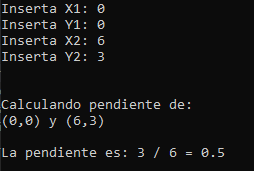
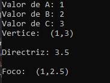
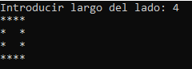
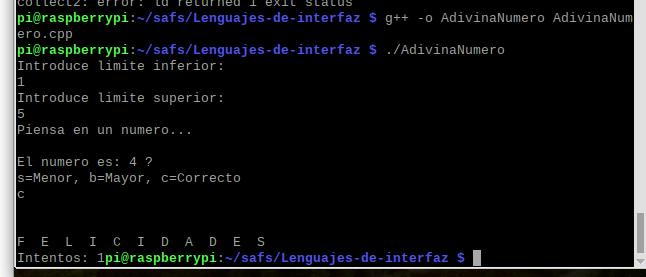

# Lenguajes-de-interfaz
## CAPITULO 2
#### 92. Introducir dos parejas de coordenadas de la linea recta  que contiene los puntos e imprimir los resultados como números racionales en sus mínimas expresiones. Si el resultado es negativo, hacer que el numerador sea el número negativo.
```c++

#include <iostream>

using namespace std;

int main()
{
    float x1, y1, x2, y2,m;
    cout << "Inserta X1: ";
    cin >> x1;
    cout << "Inserta Y1: ";
    cin >> y1;
    cout << "Inserta X2: ";
    cin >> x2;
    cout << "Inserta Y2: ";
    cin >> y2;
    cout << endl << endl;
    cout << "Calculando pendiente de: " << endl;
    cout << "(" << x1 << "," << y1 << ")" << " y " << "(" << x2 << "," << y2 << ")"<<endl<<endl;
    m = (y2 - y1) / (x2 - x1);
    cout << "La pendiente es: " << (y2 - y1)<<" / " << (x2 - x1)<<" = "<<m << endl;

}
    
```

#### 94. Introducir A, B, y C para la parábola y=Ax2+Bx+C, donde A!=0. Calcular la ecuación de la directriz y las coordenadas del foco.
```c++
#include <iostream>

using namespace std;

int main()
{
    double a, b, c, x, y, directriz, foco, distancia;
    cout << "Valor de A: ";
    cin >> a;
    cout << "Valor de B: ";
    cin >> b;
    cout << "Valor de C: ";
    cin >> c;

    if (a != 0)//si A es diferente a 0 entonces:
    {
        //Calcular vertice
        if (a > 0) //si A es mayor que 0 entonces: 
        {
            x = a; //valor de x
        }
        else if (a < 0) //si A es menor que 0, entonces:
        {
            x = a * -1;
        }
        y = c; //valor de y
        cout << "Vertice: " << " (" << x << "," << y << ")" << endl << endl;

        //Calcular distancia
        distancia = abs(b - c);

        //Calcular directriz
        directriz = c + (distancia / 2);
        cout << "Directriz: " << directriz << endl << endl;

        //Calcular foco
        cout << "Foco: " << " (" << x << "," << y - (distancia / 2) << ")" << endl;
    }
    else //sino:
    {
        cout << "Por favor introduce un valor diferente a 0 para A";
    }
}

```

## CAPITULO 10
#### 5. Programar la computadora para que "dibuje" un cuadro en la terminal
```c++
#include <iostream>
#include <conio.h>

using namespace std;


int main()
{
    int lado;
    cout << "Introducir largo del lado: ";
    cin >> lado;
    for (int i = 0; i < lado; i++)//fila
    {
        for (int j = 0; j < lado;j++)//columna
        {
            if (i == 0 || j == 0 || i == lado - 1 || j == lado - 1) {
                cout << "*";
            }
            else
            {
                cout << " ";
            }
        }
       cout << endl;
        
    }
}
```

#### 6. La computadora trata de adivinar un número que tiene usted en mente. Primero, ella da un número y usted le dice si es demasiado alto, demasiado bajo o correcto. En base a la información que se le proporcione, la computadora ensaya de nuevo. El proceso continua hasta que la computadora acierta el número. Generar un programa que genere este juego de tanteos.
```c++
#include <iostream>
#include <ctime>
#include <cstdlib>
#include <stdlib.h>
#include <time.h>

using namespace std;
int main()
{
    //Declaración de variables
    int LimInferior, LimSuperior, num;
    char entrada;
    srand(time(NULL));
    //Insercion de limites
    cout << "Introduce limite inferior: " << endl;
    cin >> LimInferior;
    cout << "Introduce limite superior: " << endl;
    cin >> LimSuperior;

    num = (LimInferior) + rand() % (LimSuperior -LimInferior);//genera numero aleatorio
   
    cout << "Piensa en un numero..."<<endl << endl;
    int cont = 0;
  
    do 
    {
        
        cont++;
        
        cout << "El numero es: " << num << " ?" << endl;
        cout << "s=Menor, b=Mayor, c=Correcto" << endl;
        cin >> entrada;
        switch (entrada)
        {
        case 's':
            LimSuperior = num;
            num = (LimInferior)+rand() % (LimSuperior - LimInferior);
            break;
        case 'b':
            LimInferior = num;
            num = (LimInferior)+rand() % (LimSuperior - LimInferior);
            break;
        case 'c':
            cout << " " << endl << endl;
            cout << "F  E  L  I  C  I  D  A  D  E  S " << endl;
            cout << "Intentos: "<<cont;
            break;
        default:
            cout << "Por favor introduce un valor existente"<<endl;
            break; 
        }


    } while (entrada != 'c');
      
}
```


#### 7. Correr un programa que pida a dos jugadores que adivinen un número que la computadora saque al azar entre 1 y 75. El programa dará 15 puntos al jugador que de la respuesta mas cercana.
```c++
#include <iostream>
#include <stdlib.h>
#include <time.h>
#include <ctime>
#include <cstdlib>
#include <stdlib.h>
using namespace std;
int main()
{
    int num;
    int p1;
    int p2;
    int diferencia1, diferencia2;
    int cercano;
    srand(time(NULL));
    num = 1 + rand() % 75-1;
    

    cout << "Player1: ";
    cin >> p1;
    cout << "Player2: ";
    cin >> p2;


    if (num == p1)
    {
        cout << "Ganador: Player1 +15 puntos" << endl;
    }
    else if (num == p2)
    {
        cout << "Ganador: Player2 +15 puntos" << endl;
    }
    else
    {
        diferencia1 =abs(num - p1);
        diferencia2 = abs(num - p2);
        if (diferencia1 > diferencia2)
        {
            cout << "Ganador: Player2 +15 puntos" << endl;
        }
        else
        {
            cout << "Ganador: Player1 +15 puntos" << endl;
        }
    }

    cout << "El numero random es: " << num << endl;
}
```
